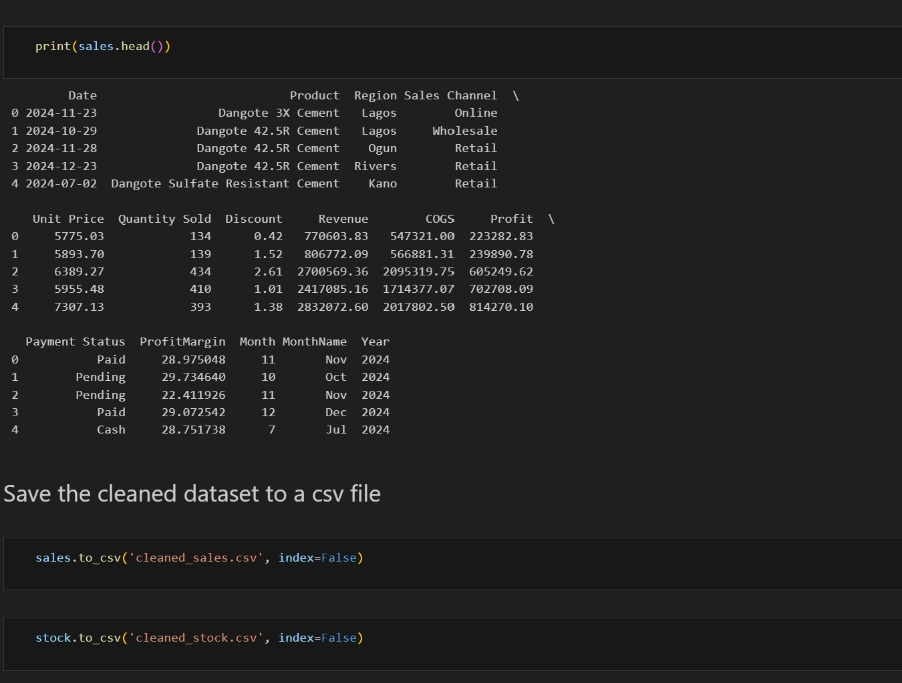
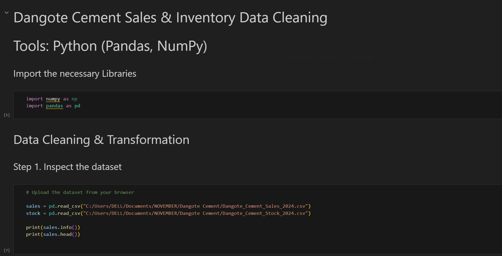
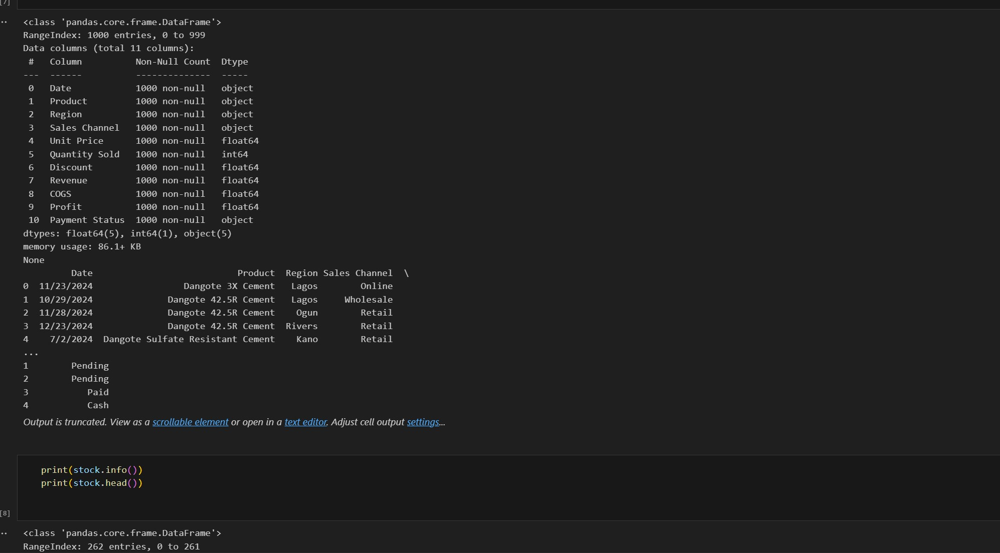
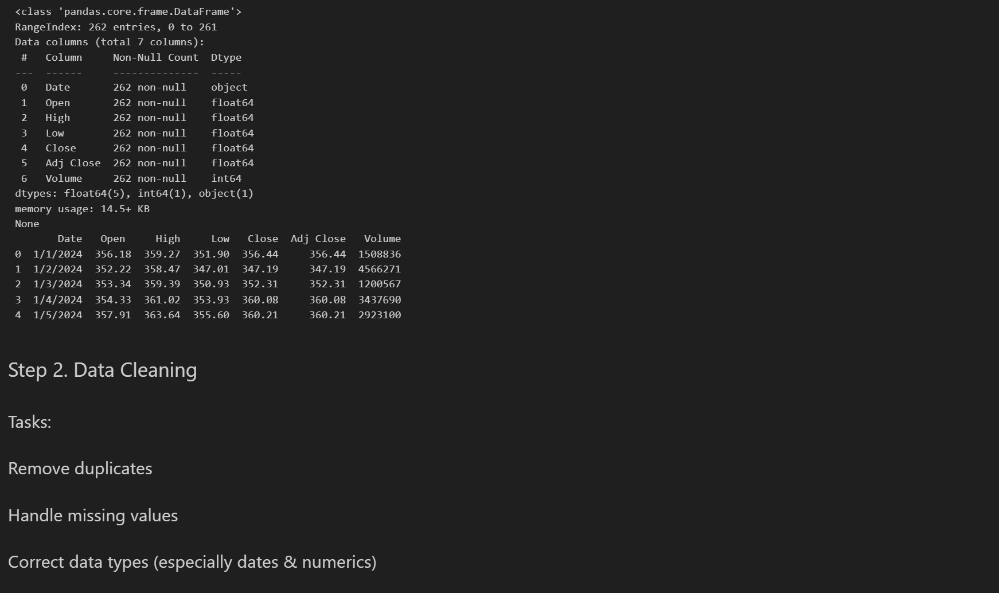
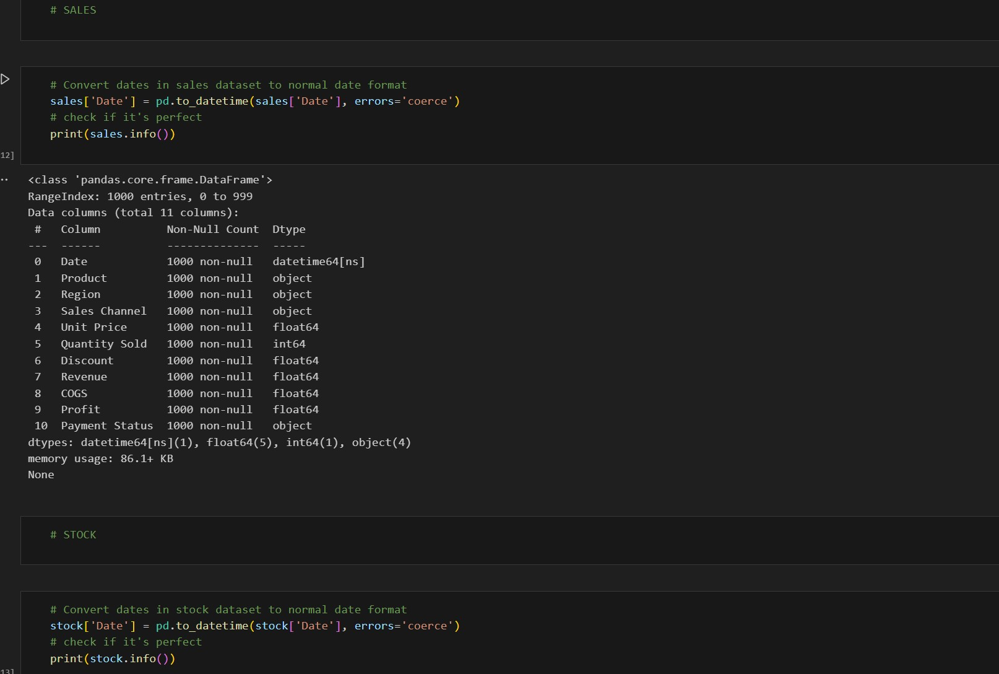
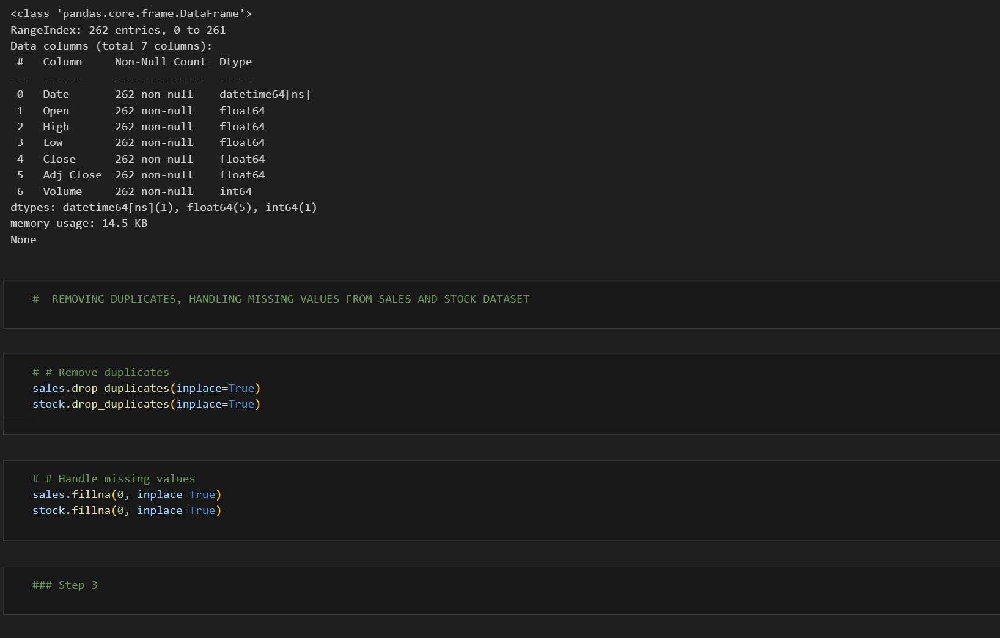
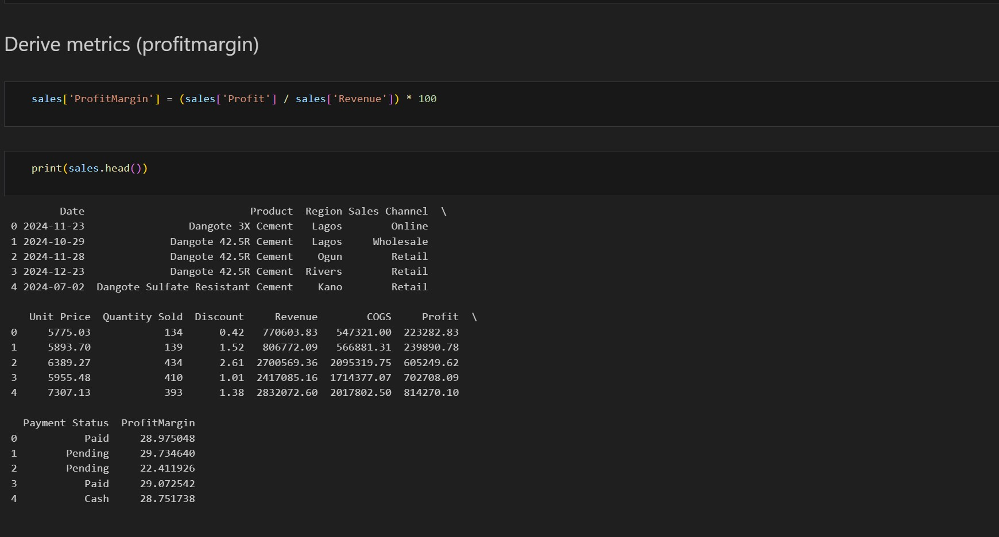
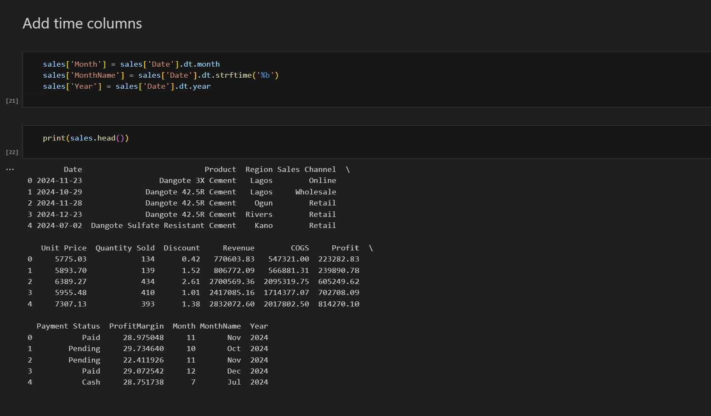
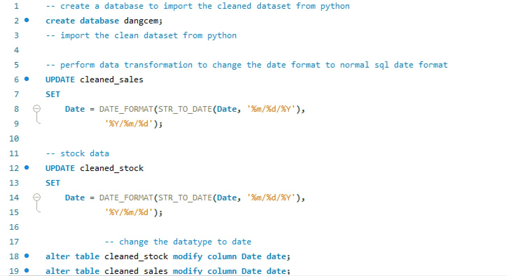
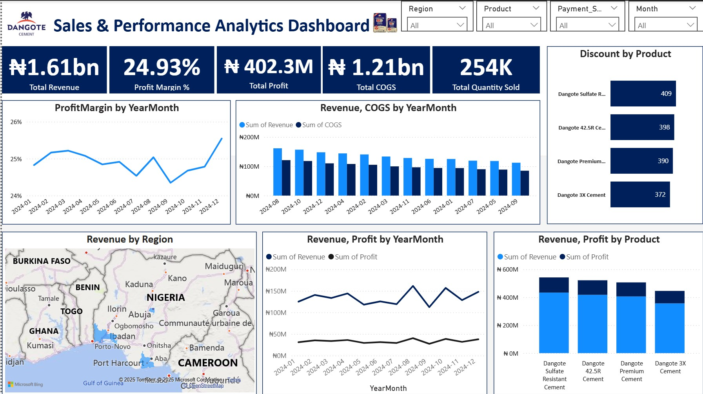

# 🧱 Dangote Cement 2024 Sales & Stock Data Analysis

A full-cycle data analytics project uncovering sales, inventory, and stock insights for Dangote Cement using Python, SQL, and Power BI.

---

## 📖 Story Behind the Project

 In 2024, Dangote Cement, Africa’s leading cement manufacturer, sought to uncover deeper insights into its sales performance, inventory efficiency, and stock market behavior. This project tells the story of how raw data was transformed into business intelligence, empowering strategic decisions with Python, SQL, and Power BI.

## 🎯 Objectives
The project explored five key business questions:
- How did sales performance vary across regions, products, and months?
- Which products are fast-moving, and how efficient is inventory turnover?
- What are the profitability metrics — Revenue, COGS, and Profit Margin?
- How consistent are customer payments, and what risks exist?
- How do stock prices and volumes reflect business trends?

## 🧩 Data Overview
Two main datasets were analyzed:
- **Sales Data	Product, region, sales channel, quantity sold, discount, revenue, COGS, profit, and payment status.**
- **Stock Data	Open, high, low, close, adjusted close, and trading volume for Dangote Cement stock.**
_You can access the datasets_ [Cleaned_Sales](https://github.com/0lait0n/-Dangote-Cement-2024-Sales-Stock-Data-Analysis/blob/main/cleaned_sales.csv) | [Cleaned_Stock](https://github.com/0lait0n/-Dangote-Cement-2024-Sales-Stock-Data-Analysis/blob/main/cleaned_stock.csv)

## 🧠 Data Preparation (Python)
Data wrangling and transformation were done in Python using Pandas and NumPy.
# Key Steps:
- Cleaned missing values and duplicates
- Standardized date format (YYYY-MM-DD)
Created new features:
- ProfitMargin (%) = (Profit / Revenue) * 100
- Month, MonthName, Year extracted from Date
- Exported cleaned data for SQL and Power BI

       
_You can access the file_ [here](https://github.com/0lait0n/-Dangote-Cement-2024-Sales-Stock-Data-Analysis/blob/main/DANGOTE_CEMENT_Python.ipynb)

## 🧮 SQL Analysis (MySQL)
Using **MySQL Workbench**, a database named dangcem was created.

The cleaned datasets were imported for structured querying and business insight extraction.

**Main SQL Tasks:**
- Sales by Region & Product:	Identify top-performing markets & items
- Sales Velocity:	Categorized products as Slow, Moderate, Fast-moving
- Profitability Metrics:	Calculated revenue, profit, COGS, and margins
- Customer Payments: Compared Paid vs Pending transactions
- Stock Analysis:	Evaluated daily price range and volume for volatility insights

_You can access the Queries_ [here](https://github.com/0lait0n/-Dangote-Cement-2024-Sales-Stock-Data-Analysis/blob/main/Dangote_Cement_SQL_Analysis.sql)

## 📊 Power BI Dashboard

The Power BI Dashboard ties the story together — merging sales, stock, and time intelligence data to deliver actionable visuals.

# 🧭 Key Dashboard Features
- Dynamic Time Intelligence Table (via DAX)
- Interactive Filters: Region, Product, Month, Payment Status
- KPIs at a Glance:
                  - 💰 Total Revenue: ₦1.61 Billion
                  - 📈 Profit: ₦402.33 Million
                  - 📦 Quantity Sold: 254K Units
                  - ⚙️ COGS: ₦1.21 Billion
                  - 📊 Avg. Profit Margin: 24.86K

_You can access the Queries_ [here](https://github.com/0lait0n/-Dangote-Cement-2024-Sales-Stock-Data-Analysis/blob/main/Dashboard.pbix)

# Highlights:
- Monthly revenue and profit trends
- Profit margin by product and region
- Payment status breakdown
- Stock price range and trading volume visualization

## 🧾 Insights & Findings
- ✅ Top Regions & Products: Certain areas and cement types dominated in both sales volume and profitability.
- 💳 Pending Payments: Highlighted the need for stronger credit control.
- 📅 Seasonal Trends: Identified high-performing months for planning campaigns.
- 📈 Stock Volatility: High trading volume periods matched revenue peaks.
- ⚙️ Operational Efficiency: Moderate inventory movement indicated areas to improve logistics.

## 💡 Recommendations
- Enhance Cost Control – Reduce COGS to improve margins.
- Follow Up on Pending Payments – Strengthen cash flow management.
- Leverage Time Intelligence Dashboards – Anticipate high/low demand periods.
- Maintain Real-Time Monitoring – Use Power BI dashboards for proactive insights.

## 🧰 Tools & Technologies
- 🐍 Python (Pandas, NumPy)	Data cleaning & feature engineering
- 🗄️ MySQL Workbench	Querying and analysis
- 📊 Power BI	Dashboard & storytelling
- 📘 Excel	Initial validation & exploration

## ⭐ Project Summary

 A complete end-to-end data analysis of Dangote Cement’s 2024 Sales & Stock performance — combining data cleaning, SQL analysis, and Power BI storytelling to turn raw data into business strategy. 

